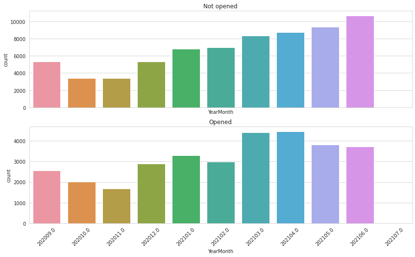
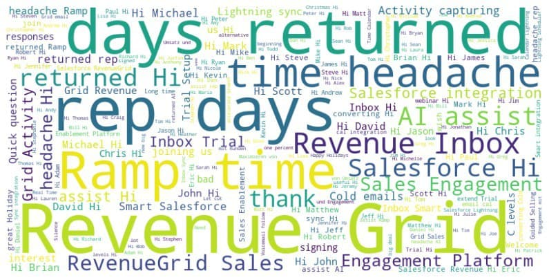
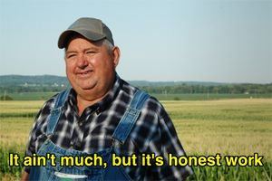

# 
CSC Hackathon 2021, Emails classification

## 
(not) a dream team

- Andrii Yerko
- Artem Dikhtiar

- Volodymyr Kuzko
- Oleksandr Bratus

## "Conservative solution": Logistic Regression + analytical skills :)
We started with EDA:

Based on EDA we created the following features, and trained the LogisticRegression on them:

- **MailBoxID** -> One Hot (29 uniques)
- **ContactID** -> _dropped_
- **TimeZone** column -> _TimeZone_, Region
- **TimeZone, SentOn** -> Recipient Hour (Sent time + TimeZone) 
  - Recipient Hour  -> DayTime features (Morning, Day, Evening, Night)
- **Subject** -> 
  - length
  - IsResponse (1 if starts with RE:)
  - Stemming + Bag Of Words, ngrams=(1, 2), num_features=15000

-> feature selection -> LogisticRegression

---

### Embeddings? word2vec? BERT?

---

### Achieved 6th place: 0.54293 f1 on a private leaderboard

